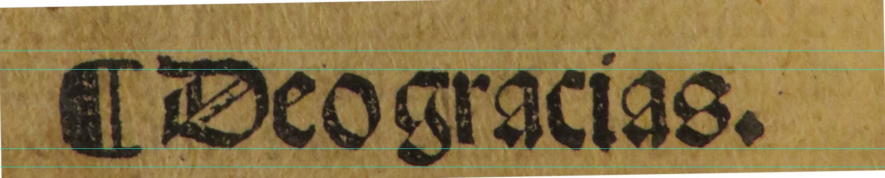

# Junta Burgos 1551
Español [English](README.md)

## Introducción
El objetivo de este proyecto es la recreación del tipo
de letra gótica de Tortis o letra de Calderilla que se usó 
principalmente en Francia, Italia y España desde el periodo 
incunable hasta mitad del siglo XVI.

Es el tipo de letra con el que se imprimió el Lazarillo de Tormes,
La Celestina, Tirant lo Blanch y prácticamente cualquier libro de la 
época.

Vamos a recrear digitalmente el tipo de letra usada por el impresor 
[Juan de Junta](http://dbe.rah.es/biografias/49373/juan-de-junta), 
representante en España de la 
[familia Giunta](https://es.wikipedia.org/wiki/Giunta_(impresores)),  
en Burgos a mediados del siglo XVI.

Las muestras se han escaneado del libro
*Enchiridion de los tiempos*
de [Alonso Venero](https://es.wikipedia.org/wiki/Alonso_Venero), 
impreso por Junta en 1551.

### Descarga
*  Puedes descargarlo de [aquí](fonts/Junta-Burgos-1551-Matriz.otf).
*  Muestra del tipo del letra en el [specimen](specimen/specimen.pdf).

### Estilo
El objetivo es diseñar un tipo de letra que imite el aspecto que 
tiene el texto de los libros impresos con letra gótica rotunda de 
suma o de Tortis, también llamada de calderilla.

Las herramientas y el medio en el que se escribe influyen en la 
forma de las letras.

Así el texto manuscrito con pluma tiene un grosor variable según 
el ángulo en el que se mantenía la pluma en contacto con el papel. 

El grabador de punzones imitaba las formas del texto manuscrito 
pero estaba grabando los punzones de un material muy duro en un 
tamaño muy pequeño. La precisión era mucha para un trabajo manual, 
pero en los tipos pequeños se ven imperfecciones. 

Con el punzón se grababa la matriz donde se fundía plomo que 
formaba los tipos de letra.

Tras escanear los textos se realizan los trazos siguiendo 
aproximadamente la mancha que ha quedado en el papel

## Referencias
*  [A book about how to create new typefaces using FontForge](http://designwithfontforge.com/en-US/Introduction.html)
*  [open-baskerville](https://github.com/klepas/open-baskerville)
*  [Jena1330](https://github.com/Anaphory/Jena1330)
*  [An introduction to OpenType Substitution Features](https://ilovetypography.com/OpenType/opentype-features.html)
*  [FontForge editexample](https://fontforge.github.io/en-US/tutorials/editexample/)
*  [Alter Littera - New letters of old](http://www.alterlittera.com/index.html)
*  Barjau, Santi; Quiney, Aitor. [El tipo Gótico Incunable de Eudald Canibell: nuevas aportaciones históricas y artísticas](http://www.brapci.inf.br/index.php/res/download/79412)
*  [Marco del especimen](https://www.iconspng.com/clipart/ornate-curly-column-frame/ornate-curly-column-frame.svg)

## Estado
Primera versión beta

*  Caracteres ASCII
*  Minúsculas y mayúsculas con tilde y macrón y eñes
*  Ese larga, ligaduras y caracteres antiguos alternativos
*  Interletraje personalizado

