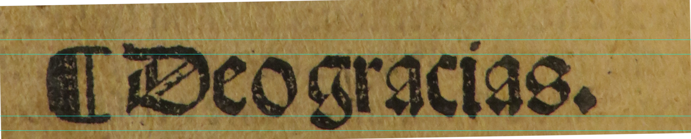

# Junta Burgos 1551
[Español](README.es.md) English

## Introduction
Digital recreation of the font used by the printer [Juan de Junta](http://dbe.rah.es/biografias/49373/juan-de-junta), who was the agent in Spain of the Iunta family in Burgos in the middle of the XVI century.

The samples were scanned from the book
*Enchiridion de los tiempos* 
from  [Alonso Venero](https://es.wikipedia.org/wiki/Alonso_Venero), 
printed by Junta in 1551.

### Download
You can download from [here](fonts/Junta-Burgos-1551-Matriz.otf).

### Style
The aim is the creation of a type font that imitate the style of the books printed with Rotunda Script.

Writing tools and materials affects shape of the letters.

Así el texto manuscrito con pluma tiene un grosor variable según el ángulo en el que se mantenía la pluma en contacto con el papel. 

El grabador de punzones imitaba las formas del texto manuscrito pero estaba grabando los punzones de un material muy duro en un tamaño muy pequeño. La precisión era mucha para un trabajo manual, pero en los tipos pequeños se ven imperfecciones. 

Con el punzón se grababa la matriz donde se fundía plomo que formaba los tipos de letra.

Estos tipos se utilizaban durante años sufriendo desgaste y roturas.

## References
*  [A book about how to create new typefaces using FontForge](http://designwithfontforge.com/en-US/Introduction.html)
*  [open-baskerville](https://github.com/klepas/open-baskerville)
*  [Jena1330](https://github.com/Anaphory/Jena1330)
*  [An introduction to OpenType Substitution Features](https://ilovetypography.com/OpenType/opentype-features.html)
*  [FontForge editexample](https://fontforge.github.io/en-US/tutorials/editexample/)

## Milestones
*  o y n. Hecho
*  videospan (letras que definen el estilo)
*  minúsculas
*  mayúsculas
*  alternativas 

